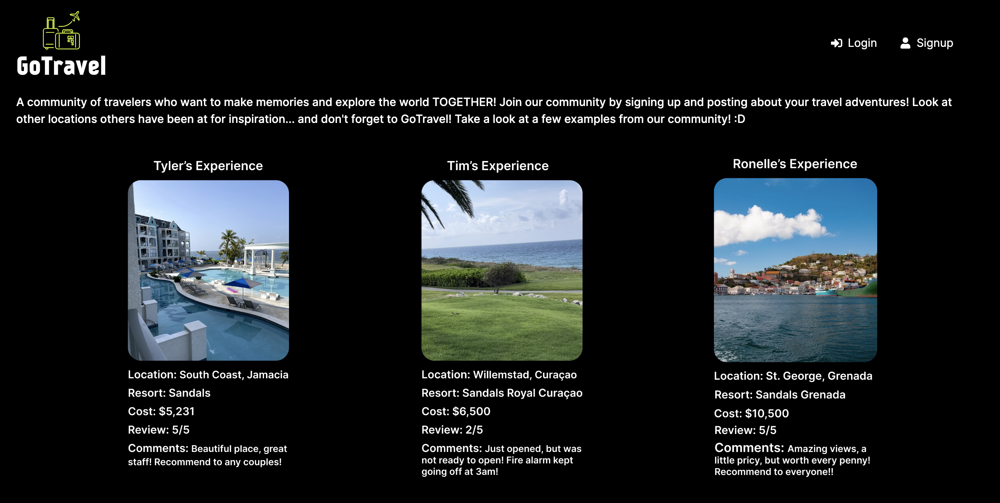
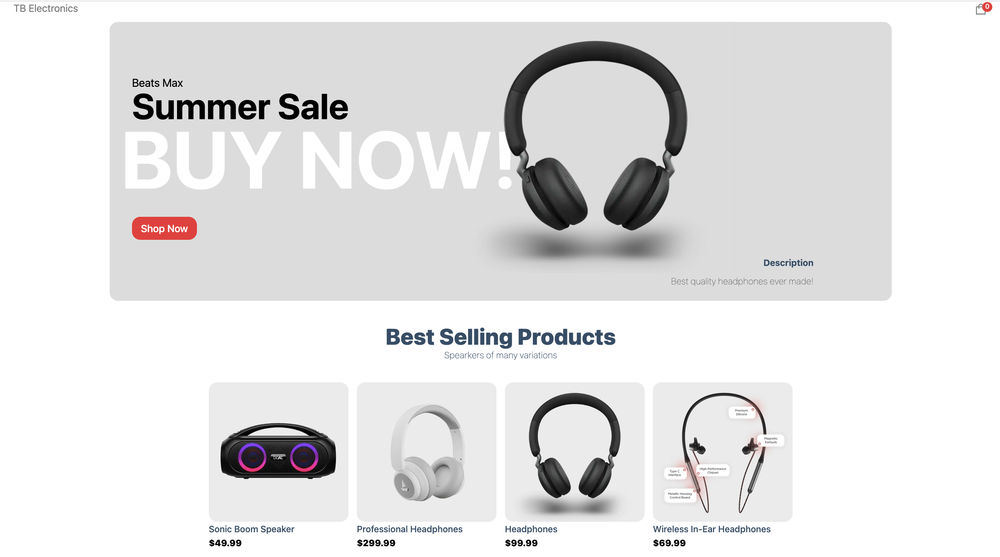

  
<!--  -->
  
    
<!--  -->
  

<h3 align="center">I'm an experienced React/Front End software engineer with a strong background in web development and a passion for building user-friendly, efficient, and scalable applications. Having years of experience with JavaScript, HTML, CSS, and other web development technologies.
</h3>

<h1 align="center">Projects</h1>
<table bordercolor="#66b2b2" >
  
  <tr>
    <td width="50%" valign="top">
      <h3 align="center">GoTravel</h3>
         
       
         
    

        
        
     

            
<strong>React, Redux, Node/Express, MongoDB, Tailwind, JWT, HTML, CSS </strong> - A responsive full stack (MERN) web application to allow users to post about their travel experiences, save them in a personal dashboard, as well as having access to other's expereince for future travel inspirations.

    </td>
    <td width="50%" valign="top">
      <h3 align="center">TB Electronics</h3>
         
       
         
    

        
        
     

      
<strong>React, Nextjs, Stripe, HTML, CSS </strong> - Fully functional eCommerce store, with Stripe integration, easily customizable and easy to use, with individual product pages including add to cart/buy-now functionality. 

     </td>
    </tr>
  
  <tr>
    <td width="50%" valign="top">
      <h3 align="center">Travel Journal</h3>
         
       
         
    

        
        
     

            
<strong>React, HTML5, CSS3, Vanilla Javascript</strong> - Travel Journal built using React with dynamic rendering!

    </td>
    <td width="50%" valign="top">
      <h3 align="center">NASA Picture Of The Day!</h3>
         
       
         
    

        
        
     

            
<strong>HTML5, CSS3, RESTful API & Javascript</strong> - NASA Image of the day, beautifully rendered with background stars animation! 

     </td>
    </tr>
  
</table>

<h3 align="left">Languages and Tools:</h3>

             

